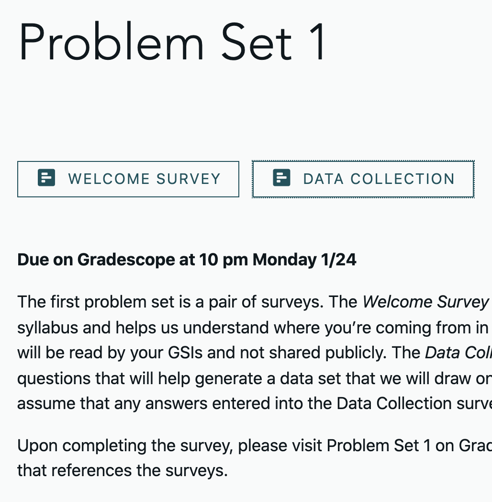
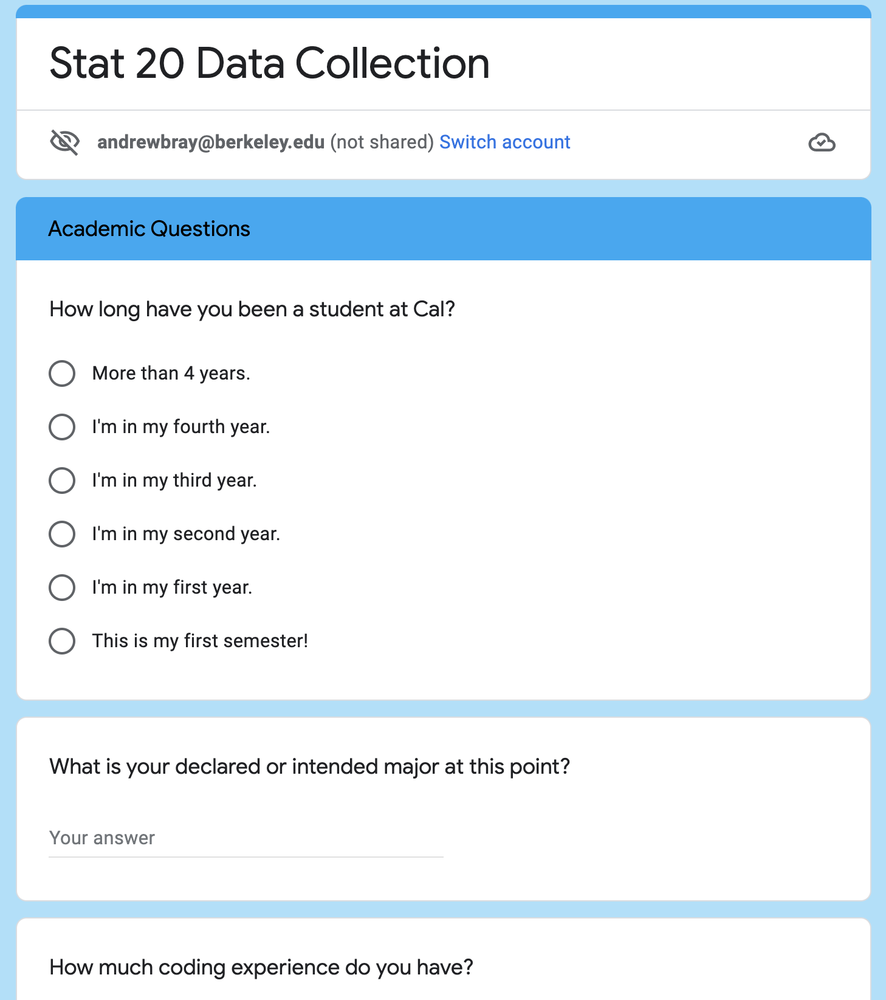

```{r setup}
#| include=FALSE,
#| warning=FALSE
knitr::opts_chunk$set(message = FALSE,
                      warning = FALSE,
                      echo = FALSE,
                      fig.align = "center",
                      fig.retina = 3)

library(tidyverse)
library(xaringanthemer)
source("https://raw.githubusercontent.com/stat20/course-materials/master/assets/stat20-style.r")
```

class: center, middle

# Lab 3: Class Survey
### Introduction to Probability and Statistics

Lab will be begin on Berkeley time 11:10 am.

---
class: middle

# Introductions

---
## Goals
--

1. Familiarize ourselves with the data collected though the class survey in PS 1.

  - Unit of obs, types of variables

--

2. Plan out visualizations to capture relationships in the data and set expectations for the trends that you will see.

--

3. Describe each of the visualizations in terms of the Grammar of Graphics.

--

.task[
Please put your laptops away and take out a some paper / tablet for notes and sketches.
]


---
## The source of the data: the students of STAT 20
--

.pull-left[
```{r}

```
]
--
.pull-right[
```{r}

```
]

---

```{r}
library(stat20data)
data(survey)
survey
```

