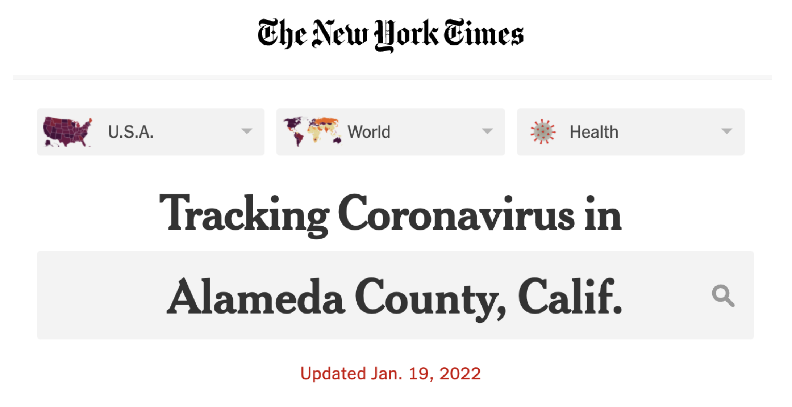

```{r setup, include=FALSE, warning=FALSE}
knitr::opts_chunk$set(message = FALSE,
                      warning = FALSE,
                      echo = FALSE,
                      fig.align = "center",
                      fig.retina = 3)

library(tidyverse)
library(xaringanthemer)
source("https://raw.githubusercontent.com/stat20/course-materials/master/stat20-style.r")
```

class: center, middle

```{r echo = FALSE, out.width="20%"}
knitr::include_graphics("assets/images/stat20-hex.png")
```


# Welcome to Stat 20!
### Introduction to Probability and Statistics

Lecture will be begin on Berkeley time 11:10 am 

---

## Agenda

1. What's going on here?
    - Breakout rooms
    
2. Why are we here?

3. Course structure

4. What next?

---

class: middle, center

# What's going on here?

---

background-image: url("assets/images/shoebill-1.png")
background-size: contain

---
## Group Discussion

In breakout rooms, please `r emo::ji("camera_flash")` turn your camera on and...

--

1. Take turns introducing yourselves with your

  - name
  - year at Cal
  - major
  - most delicious food you ate over winter break
  
--

2. Formulate at least **three** possible explanations for what's going on in the picture.  

--

3. Enter them at [pollev.com/stat20](pollev.com/stat20) or upvote existing explanations if they are very similar to your own.

.right[You will have **5 minutes**.]

---
class: middle

<center>
<iframe src="https://embed.polleverywhere.com/discourses/du3MbVG7RWdS5vXspW6hY?controls=none&short_poll=true" width="800px" height="600px"></iframe>
</center>

---

background-image: url("assets/images/shoebill-2.png")
background-size: contain

---

```{r echo = FALSE, out.width = "70%"}
knitr::include_graphics("assets/images/shoebill-2.png")
```

Does this image change which claims are more or less likely?

.task[Up and down vote explanations at pollev.com/stat20.]

---
class: middle

<center>
<iframe src="https://embed.polleverywhere.com/discourses/du3MbVG7RWdS5vXspW6hY?controls=none&short_poll=true" width="800px" height="600px"></iframe>
</center>

---

background-image: url("assets/images/shoebill-3.png")
background-size: contain

---
class: center, middle

# Why we're here

---

.center[.adage[To learn how to critique and construct]]
.center[.adage[claims made using data.]]

---

.center[.adage[To learn how to .red[critique] and .red[construct]]]
.center[.adage[claims made using data.]]


---
background-image: url("assets/images/Stat 20 Sketches For Slides-1.jpg")
background-size: contain

.center[.adage[To learn how to critique and construct]]
.center[.adage[claims made using data.]]

---
background-image: url("assets/images/Stat 20 Sketches For Slides-2.jpg")
background-size: contain

.center[.adage[To learn how to critique and construct]]
.center[.adage[claims made using data.]]

---
background-image: url("assets/images/Stat 20 Sketches For Slides-3.jpg")
background-size: contain

.center[.adage[To learn how to critique and construct]]
.center[.adage[claims made using data.]]

---
background-image: url("assets/images/Stat 20 Sketches For Slides-4.jpg")
background-size: contain

.center[.adage[To learn how to critique and construct]]
.center[.adage[claims made using data.]]

---
background-image: url("assets/images/Stat 20 Sketches For Slides-5.jpg")
background-size: contain

.center[.adage[To learn how to critique and construct]]
.center[.adage[claims made using data.]]

---

```{r echo = FALSE, out.width = "30%"}

```

```{r echo = FALSE, out.width = "75%"}
knitr::include_graphics("assets/images/alameda-covid.png")
```

--

Form a reasonable claim based upon this graphic. Answer (and vote!) at [pollev.com/stat20](pollev.com/stat20).

---
class: middle

<center>
<iframe src="https://embed.polleverywhere.com/discourses/bmMV8mHWltSsKIpNx7GO5?controls=none&short_poll=true" width="800px" height="600px"></iframe>
</center>

---
class: middle

<center>
<iframe src="https://embed.polleverywhere.com/multiple_choice_polls/Cqk8UllORh518xSwCnwED?controls=none&short_poll=true" width="800px" height="600px"></iframe>
</center>

---

class: center, middle

# Course Structure


---

class: center, middle

## Course Website: .red[stat20.org]


---
class: center, middle

### Please take 5 minutes to read over the syllabus.

```{r echo = FALSE}
countdown::countdown(5)
```


---
class: center, middle

## Our goal

--

.adage[Help you learn]

---
class: middle, center

# What Next?

---
# Looking forward

.pull-left[
- Look for invite to Ed forum this afternoon

- Attend lab section tomorrow
  - Zoom links will be posted to Ed and bCourses

- Join live lecture Friday (same link)

- First problem set (a survey) and lab released tomorrow morning and due Monday at 10 pm

- Slides: https://bit.ly/3KtkVqw
]

--

.pull-right[
```{r echo = FALSE}
knitr::include_graphics("https://media.giphy.com/media/XVuBomL9gXMTC/giphy.gif")
```
]
