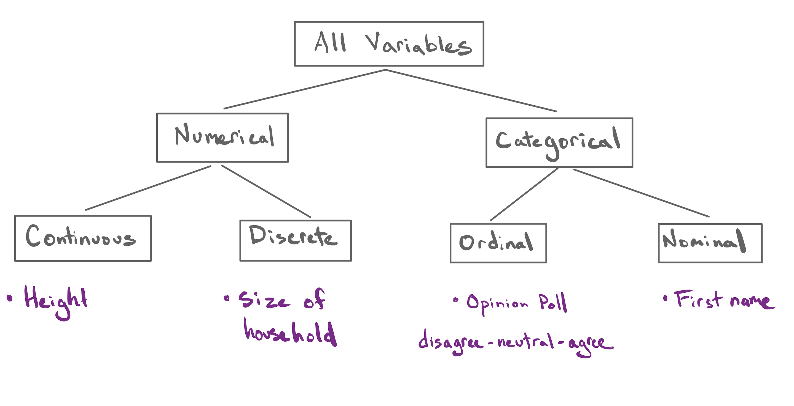
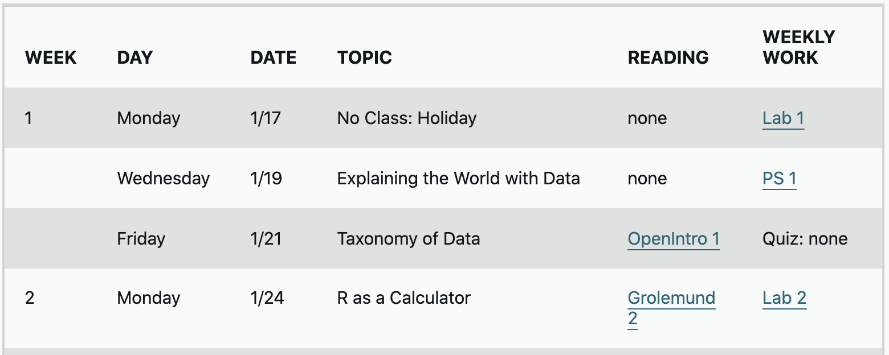
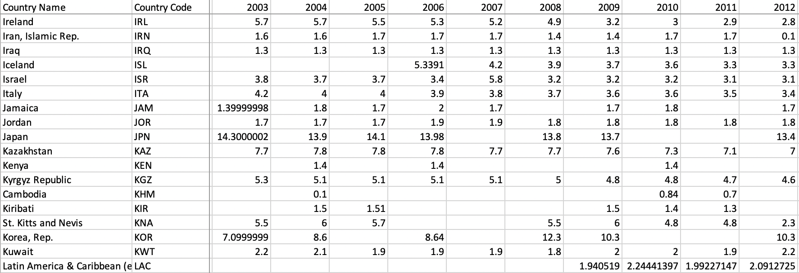

```{r setup, include=FALSE, warning=FALSE}
knitr::opts_chunk$set(message = FALSE,
                      warning = FALSE,
                      echo = FALSE,
                      fig.align = "center",
                      fig.retina = 3)

library(tidyverse)
library(xaringanthemer)
source("https://raw.githubusercontent.com/stat20/course-materials/master/assets/stat20-style.r")
```

class: center, middle

```{r echo = FALSE, out.width="20%"}
knitr::include_graphics("assets/images/stat20-hex.png")
```

# Good Morning!

While you're waiting, please send a browser tab to `pollev.com/stat20` or download the Poll Everywhere app to your phone.

---
class: center, middle

```{r echo = FALSE, out.width="20%"}
knitr::include_graphics("assets/images/stat20-hex.png")
```

# The Taxonomy of Data

## Stat 20 UC Berkeley

---
class: middle

<center>
<iframe src="https://pollev-embeds.com/stat20" width="800px" height="600px"></iframe>
</center>

---
class: middle

<center>
<iframe src="https://embed.polleverywhere.com/multiple_choice_polls/8oEFRRX8Euxw2zAICxgQv?controls=none&short_poll=true" width="800px" height="600px"></iframe>
</center>

---
class: middle

> Whenever you’re learning a new tool, for a long time you’re going to suck… But the good news is that is typical, that’s something that happens to everyone, and it’s only temporary.

.right[-Hadley Wickham]

---

## Announcements
--

1. How to stay in the loop with this class

  - Ed forum
  - Course website

--

2. Getting Help

  - Evening Help: Monday, Thursday 6:30 - 8:30 pm. Details will be posted to Ed.
  - Office Hours: See Ed.

---

## Agenda

1. The Taxonomy of Data
2. The Data Frame


---

class: middle, center

# Last Lecture

---

background-image: url("assets/images/shoebill-1.png")
background-size: contain

---
background-image: url("assets/images/Stat 20 Sketches For Slides-5.jpg")
background-size: contain

.center[.adage[To learn how to critique and construct]]
.center[.adage[claims made using data.]]


---

## Data defined


**Data:**
--
 (n) An item of (chiefly numerical) information, esp. one obtained by scientific work, a number of which are typically collected together for reference, analysis, or calculation.
--
 From latin *datum*: that which is given.
--
 Facts.
 
--

**Variable:**
--
 A characteristic of an object / unit that can be measured / recorded.

--

**Observations**: the collection of objects / units that are being measured / recorded.

---
# Taxonomy
--

.pull-left[
```{r fig.align='left'}
knitr::include_graphics("assets/images/plant-taxonomy.jpeg")
```
]

.pull-right[
Carl Linnaeus, *Systema Naturae*, 1735.
]

---

???
Draw data Taxonomy on Board

---
## The Taxonomy of Data

```{r}

```


---

<center>
<iframe src="https://pollev-embeds.com/surveys/RLvpphDN7ld3jpY2o3Dz7/respond" width="800px" height="600px"></iframe>
</center>

---

## Types of Variables
--

**Numerical**:
--
 Variables that take numbers as values that are sensible to add, subtract, etc.
 
--

**Categorical**:
--
 Variables that take categories as values (called *levels*).

--

**Continuous**:
--
 A numerical variable that takes values on an interval of the real number line.
 
--

**Discrete**:
--
 A numerical variable that takes values that have jumps between them (i.e. an ordered countable set).
 
--

**Ordinal**:
--
 A categorical variable with levels that have a natural ordering.
 
--

**Nominal**:
--
 A categorical variable with levels with no ordering.

---

<center>
<iframe src="https://pollev-embeds.com/surveys/65n7SrPLCOaRV50IR9VKJ/respond" width="800px" height="600px"></iframe>
</center>

---

class: middle, center

.adage[The **type** of variable informs the way it should be **visualized** and **analyzed**.]

---

Questions from Ed?

---
class: middle, center

# The Data Frame

---
## Observing Penguins
--

```{r out.width = "60%"}
knitr::include_graphics("assets/images/palmer-station.jpeg")
```

### Palmer Station, Antarctica

*Size measurements for adult foraging penguins near Palmer Station, Antarctica*, K. Gorman 2020.

---
## Variables: Beak Length, Beak Depth
--

```{r out.width = "60%"}
knitr::include_graphics("assets/images/culmen_depth.png")
```

--

> These are *continuous* variables.

---
## Variable: Species
--

```{r out.width = "70%"}
knitr::include_graphics("assets/images/lter_penguins.png")
```

--

> This is a nominal variable.

---
## The Data Frame

```{r message = FALSE, echo = FALSE}
library(knitr)
library(kableExtra)
library(palmerpenguins)
penguins %>%
  select(bill_depth_mm, bill_length_mm, species) %>%
  sample_n(4) %>%
  kbl()
```

A **data frame** is an array that associates the *observations* (downs the rows) with the *variables* measured on each observation (across the columns). Each cell storse a **value** observed for a variable on an observation.

--

**Unit of observation**:
--
 The type of the object on which the variables are observed.
 
--
> Here: an adult foraging *penguin* near Palmer Station, Antarctica

---
## Non-tidy Data Frames
--

From Wikipedia, a *contingency table* of sex and handedness.

```{r}
knitr::include_graphics("assets/images/non-tidy-contingency-table.png")
```

.task[
What is the unit of observation?

What are the variables?
]

---
## Non-tidy Data Frames

From the `stat20.org`, the schedule.

```{r}

```

.task[
What is the unit of observation?

What are the variables?
]

---
## Non-tidy Data Frames

From the World Bank, the number of hospital beds.

```{r}

```

.task[
What is the unit of observation?

What are the variables?
]

---
## For next time

.pull-left[
1. Take the survey and "turn it in" to Gradescope by Monday 8 pm.

2. Get help on Lab 1 in at Evening Study Session, at office hours, on Ed.

3. Take a look at the readings for next week.
]

--

.pull-right[
<iframe src="https://giphy.com/embed/Of40xPqggQrde" width="480" height="315" frameBorder="0" class="giphy-embed" allowFullScreen></iframe>
]