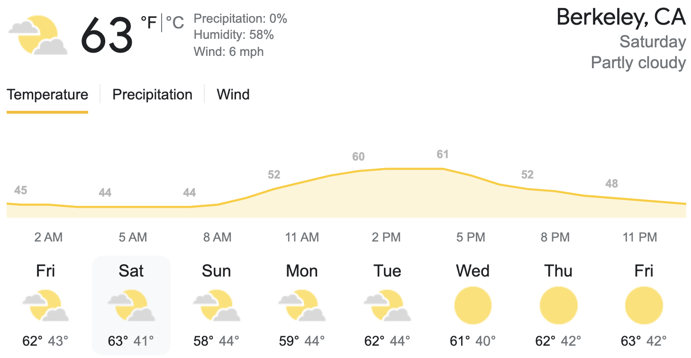

```{r setup}
#| include: FALSE
#| warning: FALSE
knitr::opts_chunk$set(message = FALSE,
                      warning = FALSE,
                      echo = FALSE,
                      fig.align = "center",
                      fig.retina = 3)

library(tidyverse)
library(xaringanthemer)
source("https://raw.githubusercontent.com/stat20/course-materials/master/assets/stat20-style.r")
```

## While you're waiting...

> As London emerged from a COVID lockdown in summer 2020, city officials were eager to encourage ridership on the Underground (the subway) by reassuring the public that it would not be crowded or unsafe. They advertized that, "each train car has a average of only 10 riders".

> Imagine you are a commuter in London and decide to try returning to using the train for your commute. You find that every time you ride, your train car is packed with far more than 10 riders.

> How can you explain this apparent paradox?

.task[
Write down one or two possible explanations. We'll share them later in lecture.
]

---
class: center, middle

```{r}
#| echo: FALSE
#| out.width: "20%"
knitr::include_graphics("assets/images/stat20-hex.png")
```

# Summarizing Numerical Data
## Stat 20 UC Berkeley

---
## Announcements

1. Next week:

  - In-person Lecture (will be recorded)
  - In-person Lab (will not be recorded, but satellite lab available)

--

2. Midterm in class Friday March 18th
  - We will post time conflict form to Ed

--

3. Final: Lec 1 and Lec 2 in Exam Group 8, Lec 3 in  Exam Group 10

--

4. Evening Study Session: Monday 6:30 - 8:30 pm in Gather

--

5. My office hours: right after class in Gather


---
## Agenda

- Constructing a Summary: Inclusion and omission
- Graphical Summaries
  - Dot plot
  - Histogram
  - Box Plot
  - Describing the shape of distributions
- Numerical Summaries: What is typical?
  - Mean
  - Median
  - Mode


---
class: middle

# Constructing a Summary
## Inclusion and Omission

---
## Summarizing Data
--

Describing large and complex data most often involves a process of *summarization*.

--

.pull-left[
### What should I **include**?

- Relevant to claim I'm trying to make, question I'm trying to answer
- Aligned with audience interest
]

--

.pull-right[
### What should I **omit**?

- Distractions, deceptions
- Replicate or assumed information
]

* * *

> We'll call the criteria used to construct your summary the *desiderata*.

---
## Summarizing `bill_length` with graphics
--

.pull-left-narrow[
```{r}
library(palmerpenguins)
library(kableExtra)
data(penguins)
penguins %>%
  select(bill_length_mm) %>%
  drop_na() %>%
  slice(1:16) %>%
  kbl()
```
]

.pull-right-wide[
```{r}
#| out.width: "100%"
knitr::include_graphics("assets/images/culmen_depth.png")
```
]

---
**Desideratum**: all information must be preserved.

* * * 
--

.pull-left-narrow[
```{r}
data(penguins)
penguins %>%
  select(bill_length_mm) %>%
  drop_na() %>%
  slice(1:16) %>%
  kbl()
```
]

--

.pull-right-wide[
```{r}
#| fig.height: 3
penguins %>%
  select(bill_length_mm) %>%
  drop_na() %>%
  slice(1:16) %>%
  ggplot(aes(x = bill_length_mm)) +
  geom_dotplot(binwidth = .1) +
  theme_gray(base_size = 20) +
  scale_y_continuous(NULL, breaks = NULL)
```

> This is called a **dot plot**.
]

---
**Desideratum**: balance general trends in the distribution with fidelity to the individual observations.

* * *
--

.pull-left-narrow[
1. Divide range of x into bins
2. Count number of obs. in each bin

> This is called a **histogram**.
]

.pull-right-wide[
```{r}
#| fig.height: 3
penguins %>%
  select(bill_length_mm) %>%
  drop_na() %>%
  slice(1:16) %>%
  ggplot(aes(x = bill_length_mm)) +
  geom_histogram(color = "white") +
  theme_gray(base_size = 20)
```
]

---
## Histogram: choice of binwidth
--

```{r}
#| fig.height: 8
#| fig.width: 16
library(patchwork)
p1 <- penguins %>%
  select(bill_length_mm) %>%
  drop_na() %>%
  slice(1:16) %>%
  ggplot(aes(x = bill_length_mm)) +
  geom_histogram(color = "white", binwidth = .2) +
  theme_gray(base_size = 20) +
  labs(title = "binwidth = .2") +
  lims(x = c(32.5, 42.5))
p2 <- penguins %>%
  select(bill_length_mm) %>%
  drop_na() %>%
  slice(1:16) %>%
  ggplot(aes(x = bill_length_mm)) +
  geom_histogram(color = "white", binwidth = .5) +
  theme_gray(base_size = 20) +
  labs(title = "binwidth = .5") +
  lims(x = c(32.5, 42.5))
p3 <- penguins %>%
  select(bill_length_mm) %>%
  drop_na() %>%
  slice(1:16) %>%
  ggplot(aes(x = bill_length_mm)) +
  geom_histogram(color = "white", binwidth = 1.5) +
  theme_gray(base_size = 20) +
  labs(title = "binwidth = 1.5") +
  lims(x = c(32.5, 42.5))
p4 <- penguins %>%
  select(bill_length_mm) %>%
  drop_na() %>%
  slice(1:16) %>%
  ggplot(aes(x = bill_length_mm)) +
  geom_histogram(color = "white", binwidth = 5) +
  theme_gray(base_size = 20) +
  labs(title = "binwidth = 5") +
  lims(x = c(32.5, 42.5))
(p1 + p2) / (p3 + p4)
```

---
**Desiderata**:  
- Reveal summary statistics  
- Flag outliers
- Allow for easy comparisons between groups

* * *
--

.pull-left[
1. Center of box: median
2. Edges of box: Q1, Q3
3. Whiskers "most of the data"
4. Dots: outliers

> This is called a **boxplot**.
]

.pull-right[
```{r}
#| fig.height: 3
penguins %>%
  select(bill_length_mm, species) %>%
  drop_na() %>%
  slice(1:16) %>%
  ggplot(aes(x = bill_length_mm)) +
  geom_boxplot() +
  theme_gray(base_size = 20)
```
]

???

Wait on boxplots until after doing summary statistics to show you can make a graphics of summary statistics (like the nyt heat dome scatterplot of maxes)

---
## Boxplots for comparison
--

```{r}
#| fig.height: 6
#| fig.width: 10
penguins %>%
  select(bill_length_mm, species) %>%
  drop_na() %>%
  ggplot(aes(x = bill_length_mm,
             y = species)) +
  geom_boxplot() +
  theme_gray(base_size = 20)
```


---
## Describing the shape of distribution
--

**Modality**

```{r}
#| out.width: 800
#| echo: FALSE
#| fig.align: 'center'
knitr::include_graphics("assets/images/modality.png")
```

--
**Skewness**

```{r}
#| out.width: 800
#| echo: FALSE
#| fig.align: 'center'
knitr::include_graphics("assets/images/skewness.png")
```


---
# Shape Question 1

Which of these variables do you expect to be uniformly distributed?

1. bill length of Gentoo penguins
2. salaries of a random sample of people from California
3. house sale prices in San Francisco
4. birthdays of classmates (day of the month)

.task[
Please vote at `pollev.com/stat20`.
]

---
class: middle

<center>
<iframe src="https://embed.polleverywhere.com/multiple_choice_polls/TRiILsvQV3qxeV1F8qoAq?controls=none&short_poll=true" width="800px" height="600px"></iframe>
</center>

---
class: middle

```{r}
#| fig.width: 10
penguins %>%
  filter(species == "Gentoo") %>%
  ggplot(aes(x = bill_length_mm)) +
  geom_histogram(color = "white") +
  theme_gray(base_size = 20) +
  labs(title = "Bill Lengths of Gentoo Penguins")
```

---
class: middle

# Numerical Summaries
## What is typical?

--

$$8, 11, 7, 7, 8, 11,  9,  6,  10,  7,  9$$


---
**Desideratum**: Synthesize the magnitudes of all of the observations into a single typical value that isn't too far from any of the observations.

* * *
--

1. Add up all of the observations.
2. Divide by the number of observations.

--

$$
\frac{8 + 11 + 7 + 7 + 8 + 11 + 9 + 6 + 10 + 7 + 9}{11} = \frac{93}{11} = 8.45
$$

--

More generally:

$$
\bar{x} = \frac{x_1 + x_2 + \ldots + x_n}{n}
$$

--

> This is the **arithmetic mean** of the data.


---
**Desideratum**:  Select a single typical value from the middle of the data, ignoring magnitudes.

* * * 

1. Put the data in order
2. Select the middle number
3. Average the middle two if necessary

--

$$ 6 \quad 7 \quad 7 \quad  7 \quad 8 \quad {\Large 8} \quad 9 \quad 9 \quad 10 \quad 11  \quad 11$$

--

> This is the **median**.

---
**Desideratum**:  Select the value that will most often be the same as one of the observations.

--
1. Select the most commonly observed value.

--

$$ 6 \quad {\Large 7 \quad 7 \quad  7} \quad 8 \quad 8 \quad 9 \quad 9 \quad 10 \quad 11  \quad 11$$

--

> This is the **mode**.


---
class: middle, center

# Which is best?

--

> It depends on your desiderata: the nature of your data and what you seek to capture in your summary.

--

.task[
Get out a piece of paper. You'll be watching a 3 minute video that discusses characteristics of a typical human. Note which numerical summaries are used and what for.
]

---
class: middle

<center>
<iframe width="1120" height="730" src="https://www.youtube.com/embed/4B2xOvKFFz4" title="YouTube video player" frameborder="0" allow="accelerometer; autoplay; clipboard-write; encrypted-media; gyroscope; picture-in-picture" allowfullscreen></iframe></center>

---
## General Advice
--

1. *Means* are often a good default for symmetric data.

--

2. *Means* are sensitive to very large and small values, so can be deceptive on skewed data.
> Use a median

--

3. *Modes* are often the only option for categorical data.

--

But there are other notions of typical...

---
class: middle

```{r}

```

---
class: middle

```{r}
knitr::include_graphics("assets/images/heat-dome-1.png")
```

---
class: middle

```{r}
knitr::include_graphics("assets/images/heat-dome-2.png")
```

---
## While you're waiting...

> As London emerged from a COVID lockdown in summer 2020, city officials were eager to encourage ridership on the Underground (the subway) by reassuring the public that it would not be crowded or unsafe. They advertized that, "each train car has an average of only 10 riders".

> Imagine you live in London and decide to try returning to using the train for your commute. You find that every time you ride, your train car is packed with far more than 10 riders.

> How can you explain this apparent paradox?

.task[
Write down one or two possible explanations. We'll share them later in lecture.
]