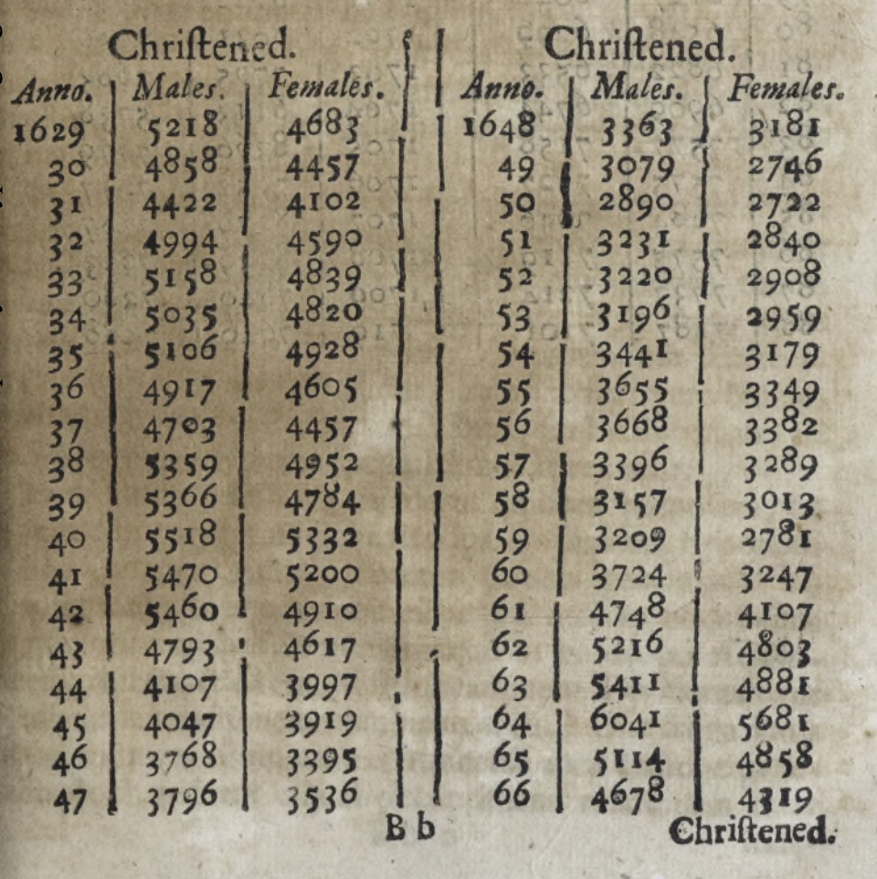
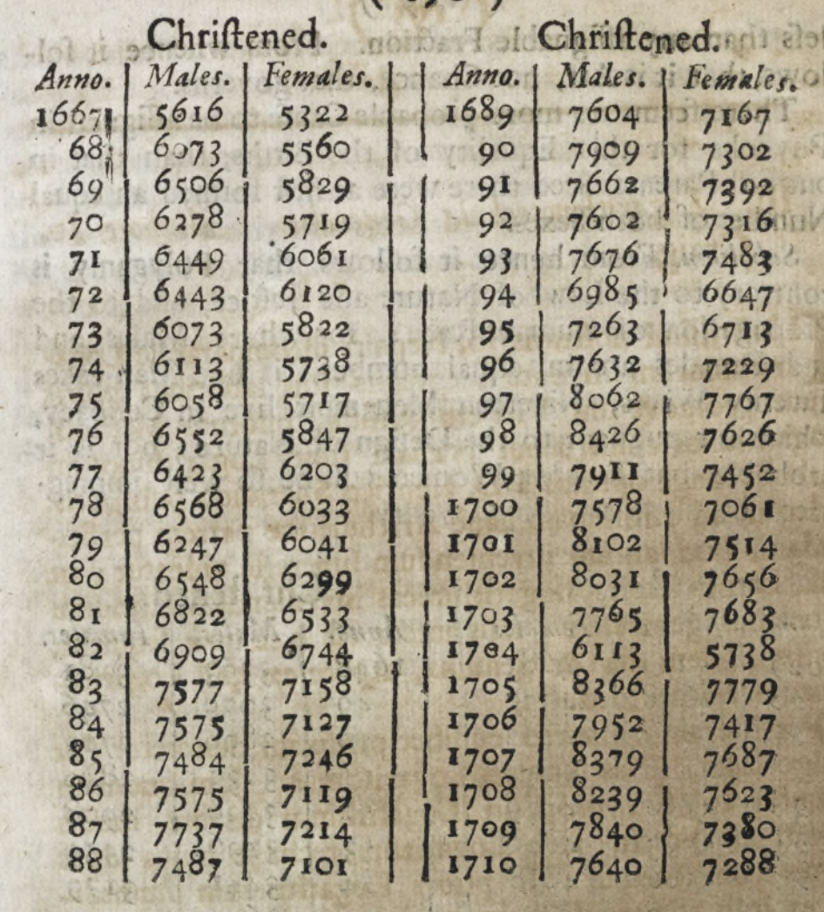
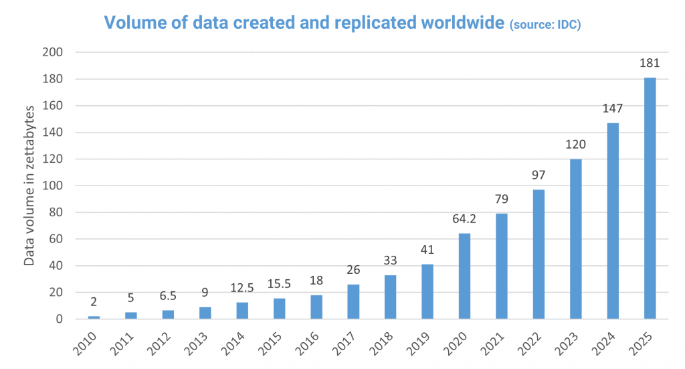
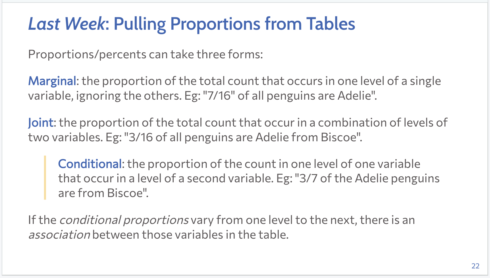

```{r setup, include=FALSE, warning=FALSE}
knitr::opts_chunk$set(message = FALSE,
                      warning = FALSE,
                      echo = FALSE,
                      fig.align = "center",
                      fig.retina = 3)

library(tidyverse)
library(xaringanthemer)
source("https://raw.githubusercontent.com/stat20/course-materials/master/assets/stat20-style.r")
```

```{r broadcast, echo=FALSE}
xaringanExtra::use_broadcast()
```

class: center, middle

```{r}
#| echo: FALSE
#| out.width: "20%"
knitr::include_graphics("assets/images/stat20-hex.png")
```

# Reproducible Science
## Stat 20 UC Berkeley

---
# Announcements
--

1. Quiz 1
  - Online on Gradescope
  - 25 minutes
  - Open Sunday 11 am - Monday 11 am
  - Covers content since last quiz
  - Retake will be available late next week

---
class: middle, center

background-image: url(assets/images/rstudio-interface.png)
background-size: contain
```{r, echo = FALSE, eval = FALSE}
knitr::include_graphics("assets/images/rstudio-interface.png")
```

--

.large[`r emo::ji("scream")`]

---
class: center, middle

# Why are we doing this?

<!-- https://www.cc.com/video/dcyvro/the-colbert-report-austerity-s-spreadsheet-error -->

---

# Reproducible Science

--

An analysis is **reproducible** if another person can take the same source materials and recreate the same conclusion.

--

A finding is **replicable** if another person create the study in full, collecting new data, and come to the same conclusion.

--

To be reproducible, an analysis should

- contain the **data**
- contain the **code** that conducts the analysis
- clearly **documents** the link between the output of the code and the conclusions drawn

---

# Not a new idea

--

.pull-left-narrow[
**Royal Society**  
Founded 1660 by Robert Boyle and others
]

--

.pull-right[
```{r, out.height = "100%", echo = FALSE}
knitr::include_graphics("assets/images/royal-society.png")
# kladcat, CC BY 2.0 <https://creativecommons.org/licenses/by/2.0>, via Wikimedia Commons>
```
]

---
# What's changed?
--

Data used to be *rare, expensive, and small* and methods of analysis *simple and transparent* ...

--

.pull-left[
```{r, echo = FALSE}

```
]

.pull-right[
```{r, echo = FALSE}

```
]


---
# What's changed?

Data used to be *rare, expensive, and small* and methods of analysis *simple and transparent* ...
--
but now data is *common, cheap, and large* and method of analysis have become increasingly *complex*.

--

.pull-left[
```{r, out.width = "160%", echo = FALSE}
knitr::include_graphics("assets/images/data-deluge.png")
```
]

--

.pull-right[
```{r, out.width = "100%", echo = FALSE}

```
]

---
## Tools up to the task
--

1. RMarkdown

2. Jupyter Notebook

3. Quarto

---
class: middle

```{r, echo = FALSE}
knitr::include_graphics("assets/images/markdown-1.png")
```

---
class: middle

```{r, echo = FALSE}
knitr::include_graphics("assets/images/markdown-2.png")
```

---

Demo

---
## Tenets of a Reproducible Analysis

An analysis is *reproducible* if another person can take the same source materials and recreate the same conclusion.

--

To be reproducible, an analysis should

- contain the **data**
- contain the **code** that conducts the analysis
- clearly **documents** the link between the output of the code and the conclusions drawn

---
class: middle, center

# For this class

Every data analysis must be a reproducible data analysis

--

.adage[Nullius in Verba]

---
class: middle

# Associations in Graphics

---

500 people are asked the following questions.

1. What is your age?
2. What is your annual income?
3. What is your party affiliation? (Rep, Dem, or Ind)
4. Which economic class do you consider yourself? (lower, working middle, upper)

.task[
Please sketch one plot that expresses the relationship between the data collected on `age` and `income` and a second plot that expresses the relationship between `party` affiliation and economic `class`.
]

--

```{r}
countdown::countdown(2, font_size = "2em")
```

---

500 people are asked the following questions.

1. What is your age?
2. What is your annual income?
3. What is your party affiliation? (Rep, Dem, or Ind)
4. Which economic class do you consider yourself? (lower, working middle, upper)

.task[
Please sketch one plot that expresses the relationship between the data collected on `age` and `income` and a second plot that expresses the relationship between `party` affiliation and economic `class`.
]

> Turn to your partner and share your sketches. Do they agree? I'll ask two pairs to share their answer.

---
## Age and Income


---
## Association
--

There is an **association** between two variables if the distribution of one variable is different as you move between levels of the second variable.

--

.right[... you've seen this before.]

--

```{r out.width="55%"}

```


---
# Associations in Scatterplots
--

Three characteristics to note:

--

1. *Direction*: positive, negative

--

2. *Strength*: weak, moderate, strong, etc.

--

3. *Shape*: linear, non-linear

---

What is the direction, strength, and shape of the association?

```{r fig.height = 6, fig.width = 6}
library(openintro)
data(corr_match)
# linear pos strong
ggplot(corr_match, aes(x = x, y = y2)) +
  geom_point()
```

--

> Positive, strong, and linear.

---

What is the direction, strength, and shape of the association?

```{r fig.height = 6, fig.width = 6}
# linear pos so-so
ggplot(corr_match, aes(x = x, y = y3)) +
  geom_point()
```

--

> Positive, weak, and linear.

---

What is the direction, strength, and shape of the association?

```{r fig.height = 6, fig.width = 6}
# linear neg so-so
ggplot(corr_match, aes(x = x, y = y4)) +
  geom_point()
```

--

> Negative, moderate, and linear.

---

What is the direction, strength, and shape of the association?

```{r fig.height = 6, fig.width = 6}
# non-linear
ggplot(corr_match, aes(x = x, y = y1)) +
  geom_point()
```

--

> Strong and non-linear.

---

What is the direction, strength, and shape of the association?

```{r fig.height = 6, fig.width = 6}
# semi-linear neg
ggplot(corr_match, aes(x = x, y = y5)) +
  geom_point()
```

--

> Negative, fairly strong, slightly curvilinear

---

What is the direction, strength, and shape of the association?

```{r fig.height = 6, fig.width = 6}
# none
set.seed(15)
data.frame(x = rnorm(100),
           y = rnorm(100)) %>%
  ggplot(aes(x = x, y = y)) +
  geom_point()
```

> There is no association.


---
## Party and Class


---
## Party and Class
--

Using data collected from the General Social Survey,

```{r}
library(infer)
data(gss)
gss <- filter(gss, partyid %in% c("dem", "ind", "rep"))
```

--

.pull-left[
```{r eval = FALSE, echo = TRUE}
ggplot(gss, aes(x = partyid, 
                fill = class)) +
  geom_bar()
```
]

--

.pull-right[
```{r echo = FALSE, fig.height = 6}
ggplot(gss, aes(x = partyid, 
                fill = class)) +
  geom_bar() +
  theme_gray(base_size = 20)
```
]

---
## Party and Class

Using data collected from the General Social Survey,

```{r}
library(infer)
data(gss)
gss <- filter(gss, partyid %in% c("dem", "ind", "rep"))
```

--

.pull-left[
```{r eval = FALSE, echo = TRUE}
ggplot(gss, aes(x = partyid, 
                fill = class)) +
  geom_bar(position = "fill") #<<
```
]

--

.pull-right[
```{r echo = FALSE, fig.height = 6}
ggplot(gss, aes(x = partyid, 
                fill = class)) +
  geom_bar(position = "fill") +
  theme_gray(base_size = 20)
```
]

---
## Party and Class

Using data collected from the General Social Survey,

```{r}
library(infer)
data(gss)
gss <- filter(gss, partyid %in% c("dem", "ind", "rep"))
```

--

.pull-left[
```{r eval = FALSE, echo = TRUE}
ggplot(gss, aes(x = class, #<<
                fill = partyid)) + #<<
  geom_bar(position = "fill")
```
]

--

.pull-right[
```{r echo = FALSE, fig.height = 6}
ggplot(gss, aes(x = class, 
                fill = partyid)) +
  geom_bar(position = "fill") +
  theme_gray(base_size = 20)
```
]


---
## Age and Party
--

Using data collected from the General Social Survey, we can study only `age`.

--

.pull-left[
```{r eval = FALSE, echo = TRUE}
ggplot(gss, aes(x = age)) +
  geom_histogram()
```
]

--

.pull-right[
```{r echo = FALSE, fig.asp = .5}
ggplot(gss, aes(x = age)) +
  geom_histogram(color = "white") +
  theme_gray(base_size = 20)
```
]


---
## Age and Party

Using data collected from the General Social Survey, we can study only `age`, or we can facet the distribution of `age` by `partyid`.

--

.pull-left[
```{r eval = FALSE, echo = TRUE}
ggplot(gss, aes(x = age)) +
  geom_histogram() +
  facet_wrap(vars(partyid)) #<<
```
]

--

.pull-right[
```{r echo = FALSE, fig.height = 6}
ggplot(gss, aes(x = age)) +
  geom_histogram(color = "white") +
  facet_wrap(vars(partyid), nrow = 3) +
  theme_gray(base_size = 20)
```
]

---

---
## Facets

```{r echo=FALSE, out.width="45%"}
knitr::include_graphics("assets/images/grammar-of-graphics.png")
# source: http://bloggotype.blogspot.com/2016/08/holiday-notes2-grammar-of-graphics.html
```

*Facets* are multiple versions of the same plot, each using a different subset of the data determined by a categorical variable.

--

```{css, echo = FALSE}
.huge .remark-code { /*Change made here*/
  font-size: 150% !important;
}
```

.huge[
```
facet_wrap(vars(<VAR>))
```
]

---
## Facetting Party and Class
--

Using data collected from the General Social Survey,

```{r}
library(infer)
data(gss)
gss <- filter(gss, partyid %in% c("dem", "ind", "rep"))
```

--

.pull-left[
```{r eval = FALSE, echo = TRUE}
ggplot(gss, aes(x = class)) +
  geom_bar() +
  facet_wrap(vars(partyid))
```
]

--

.pull-right[
```{r echo = FALSE, fig.height = 6}
ggplot(gss, aes(x = class)) +
  geom_bar() +
  facet_wrap(vars(partyid)) +
  theme_gray(base_size = 20)
```
]

---
## Looking Ahead

- Lab tomorrow
  - Using RMarkdown
  - Constructing plots with `ggplot2`
