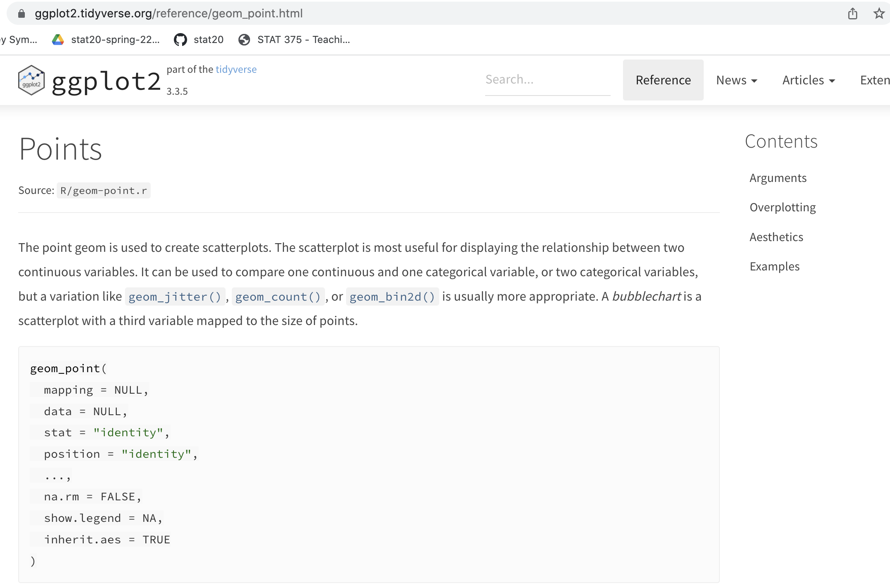

```{r setup, include=FALSE, warning=FALSE}
knitr::opts_chunk$set(message = FALSE,
                      warning = FALSE,
                      echo = FALSE,
                      fig.align = "center",
                      fig.retina = 3)

library(tidyverse)
library(xaringanthemer)
source("https://raw.githubusercontent.com/stat20/course-materials/master/assets/stat20-style.r")
```

class: center, middle

```{r}
#| echo: FALSE
#| out.width: "20%"
knitr::include_graphics("assets/images/stat20-hex.png")
```

# Advanced Data Visualization
## Stat 20 UC Berkeley

Welcome to Pimentel Hall!

Please download the polleverywhere app to your phone or send a browser tab to `pollev.com/stat20`.

---
## Announcements

- PS 2 solutions now posted to bCourses
- Lab 2 grades soon on Gradescope
- Short video on facets on bCourses by this evening
- Quiz 1 will be open Sunday 11 am to Monday 11 am
- Direct your questions during lecture to Ed post


---
## Agenda

1. Mapping vs Setting
2. Adding labels for clarity
3. The importance of scale
4. Overplotting
5. Choosing a theme
6. Annotations


---
class: middle


---
class: middle

# Mapping vs Setting

---

.task[
What will happen if I add color to this plot like this? Respond at `pollev.com/stat20`
]

```{r}
library(tidyverse)
library(palmerpenguins)
data(penguins)
```

.pull-left[
```{r echo = TRUE, eval = FALSE}
ggplot(penguins, aes(x = bill_length_mm,
                     y = bill_depth_mm)) +
  geom_point()
```

```{r echo = FALSE, fig.width=6, fig.height=5}
ggplot(penguins, aes(x = bill_length_mm,
                     y = bill_depth_mm)) +
  geom_point() +
  theme_gray(base_size = 20)
```

]

.pull-right[

```{r echo = TRUE, eval = FALSE}
ggplot(penguins, aes(x = bill_length_mm,
                     y = bill_depth_mm,
                     color = "blue")) + #<<
  geom_point()
```

```{r echo = FALSE, fig.width = 6, fig.height = 4.5}
ggplot(penguins, aes(x = bill_length_mm,
                     y = bill_depth_mm)) +
  theme_gray(base_size = 20)
```
]

---
class: middle

<center>
<iframe src="https://embed.polleverywhere.com/multiple_choice_polls/Vblf45fbOZweKM8qChhLP?controls=none&short_poll=true" width="800px" height="600px"></iframe>
</center>

---

.pull-left[
```{r echo = TRUE, eval = FALSE}
ggplot(penguins, aes(x = bill_length_mm,
                     y = bill_depth_mm,
                     color = "blue")) + #<<
  geom_point()
```
]

--

.pull-right[
```{r echo = FALSE, fig.asp=.7}
ggplot(penguins, aes(x = bill_length_mm,
                     y = bill_depth_mm,
                     color = "blue")) +
  geom_point() +
  theme_gray(base_size = 20)
```
]

--

> Does "blue" really not encode color? Let's find out.


---

.pull-left[
```{r echo = TRUE, eval = FALSE}
ggplot(penguins, aes(x = bill_length_mm,
                     y = bill_depth_mm,
                     color = "pimentel")) + #<<
  geom_point()
```
]

--

.pull-right[
```{r echo = FALSE, fig.asp=.7}
ggplot(penguins, aes(x = bill_length_mm,
                     y = bill_depth_mm,
                     color = "pimentel")) +
  geom_point() +
  theme_gray(base_size = 20)
```
]

---
## Mapping vs Setting
--

**Mapping** is the dynamic link between the values in a column of your data frame and an aesthetic attribute of your plot.

--

**Setting** is a static way to tweak the look of your plot that does *not* reference the data frame.

--

> Mapping is done within `aes()`. Setting is done outside `aes()`, generally in a `geom_()`.


---
.pull-left[
```{r echo = TRUE, eval = FALSE}
ggplot(penguins, aes(x = bill_length_mm,
                     y = bill_depth_mm)) +
  geom_point(color = "blue") #<<
```
]

--

.pull-right[
```{r echo = FALSE, fig.asp=1}
ggplot(penguins, aes(x = bill_length_mm,
                     y = bill_depth_mm)) +
  geom_point(color = "blue") + #<<
  theme_gray(base_size = 20)
```
]

---
## Which colors are available?
--

By default, R uses the following, but there are many packages that contain built-in palettes.

```{r}
colors()
```

---
class: middle, center

demo

---
## Settings for point geometry
--

.pull-left-narrow[
Inside `geom_point()`

- `color = "red"`
- `size = 10`
- `shape = 5`
]

--

.pull-right-wide[
Learning more:

```{r echo = FALSE}

```
]

---
class: middle, center

## Takeaway

--

If you want to change the look of your plot because of structure in the data, you're thinking about *mapping*.

--

If you want to just fiddle with the look, you can adjust the *settings*.


---
class: middle

# Adding labels for clarity

---

```{r fig.width = 9.2, fig.height = 7}
ggplot(penguins, aes(x = bill_length_mm,
                     y = bill_depth_mm,
                     color = species)) +
  geom_point(size = 2) +
  theme_gray(base_size = 20)
```

> What is the main point of this plot?

---
## Adding a title with `labs()`
--

The *plot title* should convey the main point / story in the plot.

--

.pull-left[
```{r echo = TRUE, eval = FALSE}
ggplot(penguins, aes(x = bill_length_mm,
                     y = bill_depth_mm,
                     color = species)) +
  geom_point() +
  labs(title = "Beak sizes differ between species") #<<
```
]

--

```{r echo = FALSE, fig.asp = .7}
ggplot(penguins, aes(x = bill_length_mm,
                     y = bill_depth_mm,
                     color = species)) +
  geom_point(size = 2) +
  labs(title = "Beak sizes differ between species") +
  theme_gray(base_size = 14)
```


---
## Modifying axis labels
--

*Axis labels* should be clear and cleanly formatted.

--

.pull-left[
```{r echo = TRUE, eval = FALSE}
ggplot(penguins, aes(x = bill_length_mm,
                     y = bill_depth_mm,
                     color = species)) +
  geom_point() +
  labs(title = "Beak sizes differ between species",
       x = "Bill length (mm)", #<<
       y = "Bill depth (mm)", #<<
       color = "Species") #<<
```
]

--

```{r echo = FALSE, fig.asp = .7}
ggplot(penguins, aes(x = bill_length_mm,
                     y = bill_depth_mm,
                     color = species)) +
  geom_point(size = 2) +
  labs(title = "Beak sizes differ between species",
       x = "Bill length (mm)",
       y = "Bill depth (mm)",
       color = "Species") +
  theme_gray(base_size = 14)
```


---
## Adding a caption
--

*Captions* can contain citations and/or expanded versions of the title.

--

.pull-left[
```{r echo = TRUE, eval = FALSE}
ggplot(penguins, aes(x = bill_length_mm,
                     y = bill_depth_mm,
                     color = species)) +
  geom_point() +
  labs(title = "Beak sizes differ between species",
       x = "Bill length (mm)",
       y = "Bill depth (mm)",
       color = "Species",
       caption = "Source: Palmer Station LTER / palmerpenguins package") #<<
```
]

--

```{r echo = FALSE, fig.asp = .7}
ggplot(penguins, aes(x = bill_length_mm,
                     y = bill_depth_mm,
                     color = species)) +
  geom_point(size = 2) +
  labs(title = "Beak sizes differ between species",
       x = "Bill length (mm)",
       y = "Bill depth (mm)",
       color = "Species",
       caption = "Source: Palmer Station LTER / palmerpenguins package") +
  theme_gray(base_size = 14)
```


---
class: middle, center

## Takeaway

--

The plot title can be used to convey the main point.

--

Axis labels should be clear and clean.

---
class: middle

# The Importance of Scale

---

```{r}
library(stat20data)
data(arbuthnot)
arbuthnot %>%
  mutate(prop_girls = girls / (girls + boys)) %>%
  ggplot(aes(x = year,
             y = prop_girls))+
  geom_line() +
  labs(title = "The proportion of christenings that are girls is...",
       x = "Year",
       y = "Prop. girls") +
  theme_gray(base_size = 20)
```

.task[
What is the most important feature of the trend here?
]

---
class: middle

<center>
<iframe src="https://embed.polleverywhere.com/multiple_choice_polls/wcHnwPs7vMny1kZgqQL8m?controls=none&short_poll=true" width="800px" height="600px"></iframe></center>

---

```{r, fig.width=8, fig.asp = 1}
library(stat20data)
arbuthnot %>%
  mutate(prop_girls = girls / (girls + boys)) %>%
  ggplot(aes(x = year,
             y = prop_girls))+
  geom_line() +
  labs(title = "The proportion of christenings that are girls is increasing",
       x = "Year",
       y = "Prop. girls") +
  xlim(1629, 1635) + 
  theme_gray(base_size = 16)
```

---

```{r, fig.width=8, fig.asp = 1}
library(stat20data)
arbuthnot %>%
  mutate(prop_girls = girls / (girls + boys)) %>%
  ggplot(aes(x = year,
             y = prop_girls))+
  geom_line() +
  labs(title = "The proportion of christenings that are girls is decreasing",
       x = "Year",
       y = "Prop. girls") +
  xlim(1703, 1707) + 
  theme_gray(base_size = 16)
```

---

```{r, fig.width=8, fig.asp = 1}
library(stat20data)
arbuthnot %>%
  mutate(prop_girls = girls / (girls + boys)) %>%
  ggplot(aes(x = year,
             y = prop_girls))+
  geom_line() +
  labs(title = "The proportion of christenings that are girls is variable",
       x = "Year",
       y = "Prop. girls") +
  theme_gray(base_size = 16)
```

---

```{r, fig.width=8, fig.asp = 1}
library(stat20data)
arbuthnot %>%
  mutate(prop_girls = girls / (girls + boys)) %>%
  ggplot(aes(x = year,
             y = prop_girls))+
  geom_line() +
  labs(title = "The proportion of christenings that are girls is stable",
       x = "Year",
       y = "Prop. girls") +
  ylim(0, 1) +
  theme_gray(base_size = 16)
```

---
## The Importance of Scale
--

You can alter the scale on which the data is presented by changing the limits of the axis.

--

- `xlim(<LOWER>, <UPPER>)`
- `ylim(<LOWER>, <UPPER>)`

--

.pull-left[
```{r, fig.width=4.5, fig.asp = 1}
arbuthnot %>%
  mutate(prop_girls = girls / (girls + boys)) %>%
  ggplot(aes(x = year,
             y = prop_girls))+
  geom_line() +
  labs(caption = "Source: Arbuthnot's London Data",
       x = "Year",
       y = "Prop. girls") +
  ylim(0, 1) +
  theme_gray(base_size = 12)
```
]

.pull-left[
```{r, fig.width=4.5, fig.asp = 1}
data(present)
present %>%
  mutate(prop_girls = girls / (girls + boys)) %>%
  ggplot(aes(x = year,
             y = prop_girls))+
  geom_line() +
  labs(caption = "Source: US Gov Present Data",
       x = "Year",
       y = "Prop. girls") +
  ylim(0, 1) +
  theme_gray(base_size = 12)
```
]

---

```{r, out.width = "50%"}
knitr::include_graphics("assets/images/brexit.png")
```

.cite[Source: Financial Times]

---
class: middle, center

## Takeaway

--

The limits of the scales can dramatically alter the interpretation of the plot.

---
class: middle

# Overplotting

---

## From the lab ...

> What is the relationship between students’ optimism for cryptocurrency and their skepticism of the effect of technology on interpersonal relationships?

--

```{r, fig.width=6, fig.asp=1}
data(class_survey)
class_survey %>%
  ggplot(aes(x = tech_relationships,
             y = crypto)) +
  geom_point() +
  theme_gray(base_size = 18)
```

---
## Overplotting
--

.pull-left[
**Overplotting** is a common effect where multiple observations overlap with one another in a plot.

```{r, fig.width = 5, fig.asp=1}
class_survey %>%
  ggplot(aes(x = tech_relationships,
             y = crypto)) +
  geom_point() +
  theme_gray(base_size = 11)
```
]

--

.pull-right[
Selected fixes:

1. Jittering the points

2. Adding transparency

3. Different geometries (hex plot, contour plots)
]

---
## Jittering
--

**Jittered** points have random noise added to both coordinates to separate them from one another.

--

.pull-left[
```{r, echo = TRUE, eval = FALSE}
class_survey %>%
  ggplot(aes(x = tech_relationships,
             y = crypto)) +
  geom_jitter() #<<
```
]

--

.pull-right[
```{r, echo = FALSE, eval = TRUE, fig.width=6.5, fig.asp=1}
class_survey %>%
  ggplot(aes(x = tech_relationships,
             y = crypto)) +
  geom_jitter() +
  theme_gray(base_size = 18)
```
]

---
## Transparency
--

Points can be made transparent by setting the **alpha** level. Alpha = 1: normal opaque points, Alpha = 0, fully transparent points.

--

.pull-left[
```{r, echo = TRUE, eval = FALSE}
class_survey %>%
  ggplot(aes(x = tech_relationships,
             y = crypto)) +
  geom_point(alpha = .1, size = 8) #<<
```
]

--

.pull-right[
```{r, echo = FALSE, eval = TRUE, fig.width=6.5, fig.asp=1}
class_survey %>%
  ggplot(aes(x = tech_relationships,
             y = crypto)) +
  geom_point(alpha = .1, size = 8)
  theme_gray(base_size = 18)
```
]

---
## Jittered and transparent
--

.pull-left[
```{r, echo = TRUE, eval = FALSE}
class_survey %>%
  ggplot(aes(x = tech_relationships,
             y = crypto)) +
  geom_jitter(alpha = .1, size = 8) #<<
```
]

--

.pull-right[
```{r, echo = FALSE, eval = TRUE, fig.width=6.5, fig.asp=1}
class_survey %>%
  ggplot(aes(x = tech_relationships,
             y = crypto)) +
  geom_jitter(alpha = .3, size = 8) +
  theme_gray(base_size = 18)
```
]

---
class: middle, center

## Takeaway

--

Plots with substantial overplotting are very misleading. It can be fixed with jittering, transparency, and geometries that aggregate.

---
class: middle

# Choosing a Theme

---

```{r}
arbuthnot %>%
  mutate(prop_girls = girls / (girls + boys)) %>%
  ggplot(aes(x = year,
             y = prop_girls))+
  geom_line() +
  labs(title = "Christenings that were girls held steady around 48%",
       caption = "Source: Arbuthnot's London Data",
       x = "Year",
       y = "Prop. girls") +
  ylim(0, 1) +
  theme_gray(base_size = 14)
```

> What other design decisions were made in constructing this plot?

---
## Themes

Many of the subtle visual design decisions - background colors, fonts, guidelines, axis tick marks, border boxes - are part of a plots **theme**. These can be changed easily by adding a new theme layer.

--

- `theme_<NAME>()`


---
## Themes in `ggplot2`
--

```{r}
library(patchwork)
p1 <- arbuthnot %>%
  mutate(prop_girls = girls / (girls + boys)) %>%
  ggplot(aes(x = year,
             y = prop_girls))+
  geom_line() +
  labs(title = "theme_minimal()",
       x = "Year",
       y = "Prop. girls") +
  ylim(0, 1) +
  theme_minimal()
p2 <- arbuthnot %>%
  mutate(prop_girls = girls / (girls + boys)) %>%
  ggplot(aes(x = year,
             y = prop_girls))+
  geom_line() +
  labs(title = "theme_classic()",
       x = "Year",
       y = "Prop. girls") +
  ylim(0, 1) +
  theme_classic()
p3 <- arbuthnot %>%
  mutate(prop_girls = girls / (girls + boys)) %>%
  ggplot(aes(x = year,
             y = prop_girls))+
  geom_line() +
  labs(title = "theme_light()",
       x = "Year",
       y = "Prop. girls") +
  ylim(0, 1) +
  theme_light()
p4 <- arbuthnot %>%
  mutate(prop_girls = girls / (girls + boys)) %>%
  ggplot(aes(x = year,
             y = prop_girls))+
  geom_line() +
  labs(title = "theme_dark()",
       x = "Year",
       y = "Prop. girls") +
  ylim(0, 1) +
  theme_dark()
(p1 + p2) / (p3 + p4)
```

> Additional themes can be found in `ggthemes` (coming soon to the Stat 20 Datahub)

---
## Solarized

`theme_solarized()` in the `ggthemes` package.

```{r}
library(ggthemes)
arbuthnot %>%
  mutate(prop_girls = girls / (girls + boys)) %>%
  ggplot(aes(x = year,
             y = prop_girls))+
  geom_line() +
  labs(x = "Year",
       y = "Prop. girls") +
  ylim(0, 1) +
  theme_solarized()
```

---
## Wall Street Journal

`theme_wsj()` in the `ggthemes` package.

```{r}
library(ggthemes)
arbuthnot %>%
  mutate(prop_girls = girls / (girls + boys)) %>%
  ggplot(aes(x = year,
             y = prop_girls))+
  geom_line() +
  labs(x = "Year",
       y = "Prop. girls") +
  ylim(0, 1) +
  theme_wsj()
```

---
## Fivethirtyeight.com

`theme_fivethirtyeight()` in the `ggthemes` package.

```{r}
library(ggthemes)
arbuthnot %>%
  mutate(prop_girls = girls / (girls + boys)) %>%
  ggplot(aes(x = year,
             y = prop_girls))+
  geom_line() +
  labs(x = "Year",
       y = "Prop. girls") +
  ylim(0, 1) +
  theme_fivethirtyeight()
```
---
## The Economist

`theme_economist()` in the `ggthemes` package.

```{r}
library(ggthemes)
arbuthnot %>%
  mutate(prop_girls = girls / (girls + boys)) %>%
  ggplot(aes(x = year,
             y = prop_girls))+
  geom_line() +
  labs(x = "Year",
       y = "Prop. girls") +
  ylim(0, 1) +
  theme_economist()
```


---
## The Excel

`theme_excel()` in the `ggthemes` package.

```{r}
library(ggthemes)
arbuthnot %>%
  mutate(prop_girls = girls / (girls + boys)) %>%
  ggplot(aes(x = year,
             y = prop_girls))+
  geom_line() +
  labs(x = "Year",
       y = "Prop. girls") +
  ylim(0, 1) +
  theme_excel()
```

---
class: center, middle

## Takeaways

--

Select a theme that coheres with what your audience will expect to see.


---
class:

# Annotations

---

```{r, fig.width=10}
arbuthnot %>%
  mutate(total = girls + boys) %>%
  ggplot(aes(x = year,
             y = total)) +
  geom_line() +
  labs(title = "Time trend in total christenings",
       x = "Year",
       y = "Total") +
  theme_light(base_size = 20)
```

> How would you describe this trend over time?

---

```{r, fig.width=10}
arbuthnot %>%
  mutate(total = girls + boys) %>%
  ggplot(aes(x = year,
             y = total)) +
  geom_line() +
  annotate(geom = "segment", x = 1642, xend = 1642,
           y = 5000, yend = 16000, color = "tomato") +
  annotate(geom = "text", label = "Civil war begins",
           x = 1648, y = 15500) +
  labs(title = "Time trend in total christenings",
       x = "Year",
       y = "Total") +
  theme_light(base_size = 20)
```

---
## Annotation

You can **annotate** a plot with lines, text, points, to draw attention to important features.

.pull-left[
```{r, echo = TRUE, eval = FALSE}
arbuthnot %>%
  mutate(total = girls + boys) %>%
  ggplot(aes(x = year,
             y = total)) +
  geom_line() +
  annotate(geom = "segment", 
           x = 1642, xend = 1642,
           y = 5000, yend = 16000, 
           color = "tomato") +
  annotate(geom = "text", 
           label = "Civil war begins",
           x = 1648, y = 15500) +
  labs(title = "Time trend in total christenings",
       x = "Year",
       y = "Total")
```
]

--

.pull-right[
```{r echo = FALSE, fig.height=5}
arbuthnot %>%
  mutate(total = girls + boys) %>%
  ggplot(aes(x = year,
             y = total)) +
  geom_line() +
  annotate(geom = "segment", x = 1642, xend = 1642,
           y = 5000, yend = 16000, color = "tomato") +
  annotate(geom = "text", label = "Civil war begins",
           x = 1648, y = 15500) +
  labs(title = "Time trend in total christenings",
       x = "Year",
       y = "Total") +
  theme_light(base_size = 20)
```
]