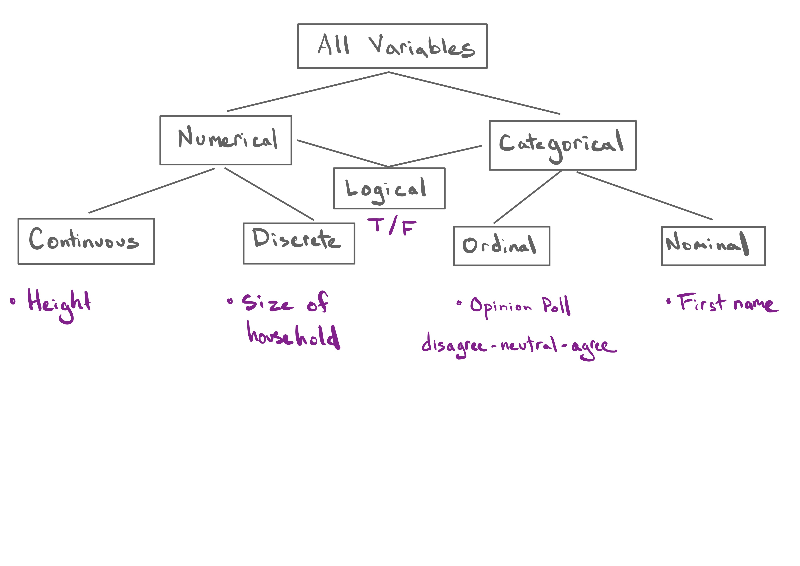

```{r setup, include=FALSE, warning=FALSE}
knitr::opts_chunk$set(message = FALSE,
                      warning = FALSE,
                      echo = FALSE,
                      fig.align = "center",
                      fig.retina = 3)

library(tidyverse)
library(xaringanthemer)
source("https://raw.githubusercontent.com/stat20/course-materials/master/assets/stat20-style.r")
```

class: center, middle

```{r}
#| echo: FALSE
#| out.width: "20%"
knitr::include_graphics("assets/images/stat20-hex.png")
```

# Subsets
## Stat 20 UC Berkeley

---
## While you're waiting...

> As London emerged from a COVID lockdown in summer 2020, city officials were eager to encourage ridership on the Underground (the subway) by reassuring the public that it would not be crowded or unsafe. They advertized that, "each train car has a average of only 10 riders".

> Imagine you are a commuter in London and decide to try returning to using the train for your commute. You find that every time you ride, your train car is packed with far more than 10 riders.

> How can you explain this apparent paradox?

.task[
Write down one or two possible explanations. We'll share them later in lecture.
]

---
## Announcements

1. Optional Quiz 1 Again
  - 11 am Thurs - 11 am Friday
  - Same format
  - Similar topics, different questions
2. 


---
## Agenda

1. Comparing values

2. Filtering data using logical vectors

3. Data Pipelines


---
class: middle

# Comparing Values


---

> 10. What are students’ perceptions of the chance that we remain in remote learning for the entire semester?

.task[
Do you think first year students would be *more* likely or *less* likely to think we would remain in remote learning for the entire semester?

Answer at `pollev.com/stat20`.
]


---
class: middle

<center>
<iframe src="https://embed.polleverywhere.com/multiple_choice_polls/CLNfqXGxTkOSbfVHAbfzo?controls=none&short_poll=true" width="800px" height="600px"></iframe>
</center>


---
## Describing `remote_sem`

```{r}
library(stat20data)
data("class_survey")
class_survey <- class_survey %>%
  select(time_at_cal, remote_sem) %>%
  mutate(remote_sem = round(remote_sem, digits = 2))
```


.pull-left-forty[
```{r echo = TRUE, eval = FALSE}
ggplot(class_survey, aes(x = remote_sem)) +
  geom_histogram()
```
]
--
.pull-right-sixty[
```{r echo = FALSE, eval = TRUE, fig.height = 3}
ggplot(class_survey, aes(x = remote_sem)) +
  geom_histogram()
```
]

--

.pull-left-forty[
Aside: *density plot*
```{r echo = TRUE, eval = FALSE}
ggplot(class_survey, aes(x = remote_sem)) +
  geom_density() #<<
```
- .tiny[Replaces histogram with a smooth curve]
- .tiny[Area under curve is 1]
]
--
.pull-right-sixty[
```{r echo = FALSE, eval = TRUE, fig.height = 3}
ggplot(class_survey, aes(x = remote_sem)) +
  geom_density()
```
]

---
## Describing `remote_sem`

.pull-left-forty[
```{r echo = TRUE, eval = FALSE}
ggplot(class_survey, aes(x = remote_sem)) +
  geom_histogram()
```
]
--
.pull-right-sixty[
```{r echo = FALSE, eval = TRUE, fig.height = 3}
ggplot(class_survey, aes(x = remote_sem)) +
  geom_histogram()
```
]

--
.pull-left-forty[
```{r echo = TRUE}
summarize(class_survey,
          mean = mean(remote_sem),
          med = median(remote_sem),
          iqr = IQR(remote_sem),
          sd = sd(remote_sem))
```
]
--
.pull-right[
The distribution of probabilities of **all** students is right-skewed with a mean probability of `r round(mean(class_survey$remote_sem), 2)` and a median probability of `r round(median(class_survey$remote_sem), 2)`, an IQR of `r round(IQR(class_survey$remote_sem), 2)` and a SD of `r round(sd(class_survey$remote_sem), 2)`.
]

---

---
## Describing first year students

How can we focus our analysis on just first year students?

--

**General goal**: Identify whether the *value* in a variable meets a *condition*.

 > Here: Is the value in `remote_sem` equal to `"I'm in my first year."`?
 
--

**Our Tool, Comparison operators**: A collection of operators that compare two values / vectors and return `TRUE` or `FALSE`.

---
## Evaluating equivalence
--


```{r fruit1, echo = TRUE, eval = FALSE}
"fruit" == "vegetable"
```
--
```{r ref.label = "fruit1", echo = FALSE}
```
--
```{r fruit2, echo = TRUE, eval = FALSE}
"fruit" == "fruit"
```
--
```{r ref.label = "fruit2", echo = FALSE}
```
--
```{r fruit3, echo = TRUE, eval = FALSE}
"fruit" != "fruit"
```
--
```{r ref.label = "fruit3", echo = FALSE}
```
--
> `==` evaluates equality, `!=` evaluates inequality.


---

```{r echo = TRUE, eval = FALSE}
c("fruit", "fruit", "vegetable") == "fruit"
```

.task[
What will this line of code return?

Respond at `pollev.com/stat20`.
]

---
class: middle

<center>
<iframe src="https://embed.polleverywhere.com/multiple_choice_polls/hRNUOmHThbrecK3PwauKs?controls=none&short_poll=true" width="800px" height="600px"></iframe></center>

---
## Evaluating equivalence, cont.
--

In R, this evaluation happens element-wise when operating on vectors.

```{r fruit4, echo = TRUE, eval = FALSE}
c("fruit", "fruit", "vegetable") == "fruit"
```
--
```{r ref.label = "fruit4", echo = FALSE}
```
--
```{r fruit5, echo = TRUE, eval = FALSE}
c("fruit", "fruit", "vegetable") != "fruit"
```
--
```{r ref.label = "fruit5", echo = FALSE}
```
--
```{r fruit6, echo = TRUE, eval = FALSE}
c("fruit", "vegetable", "boba") %in% c("fruit", "vegetable")
```
--
```{r ref.label = "fruit6", echo = FALSE}
```
--

> `%in%` can be used to evaluate membership in a set.

---
## Adding a grouping variable
--

```{r mut, echo = TRUE, eval = FALSE}
class_survey <- mutate(class_survey,
                       first_year = time_at_cal == "I'm in my first year.")
class_survey
```
--
```{r ref.label = "mut", echo = FALSE, eval = TRUE}
```


---
class: middle

# Filtering data using logical vectors


---
## Filtering rows
--

**Filtering** is the act of reducing the rows of a data frame to those that meet certain criteria.

--

```{css, echo = FALSE}
.huge .remark-code { /*Change made here*/
  font-size: 150% !important;
}
```

.huge[
```
filter(<DATAFRAME>, <LOGICAL VECTOR>)
```
]

---

```{r fil, echo = TRUE, eval = FALSE}
first_yr_df <- filter(class_survey, first_year)
first_yr_df
```
--
```{r ref.label = "fil", echo = FALSE, eval = TRUE}
```

---
## Describing `remote_sem` with statistics
--

.pull-left[
Statistics from *all* students

```{r echo = TRUE}
summarize(class_survey,
          mean = mean(remote_sem),
          med = median(remote_sem),
          iqr = IQR(remote_sem),
          sd = sd(remote_sem))
```
]
--
.pull-right[
Statistics from *first year* students

```{r echo = TRUE}
summarize(first_yr_df,
          mean = mean(remote_sem),
          med = median(remote_sem),
          iqr = IQR(remote_sem),
          sd = sd(remote_sem))
```
]

---
## Describing `remote_sem` with graphics
--

.pull-left[
Histogram for *all* students

```{r echo = TRUE, fig.height=4}
ggplot(class_survey, aes(x = remote_sem)) +
  geom_histogram()
```
]
--
.pull-right[
Histograms from *first year* and non-first year students

```{r echo = TRUE, fig.height=4}
ggplot(class_survey, aes(x = remote_sem)) +
  geom_histogram() +
  facet_wrap(vars(first_year))
```
]

---
## Comparison Operators
--

There are many comparisons that can be made for (usually) categorical data (`==`, `!=`, `%in%`) and for numerical data (`<`, `<=`, `>`, `>=`).

```{r echo = FALSE}
knitr::include_graphics("assets/images/comparison-operators.png")
```


---
## Example 1
--

> What is the mean probability of `remote_sem` for students who were very confident that we could engineer our way out of the effects of climate change (6 or above on `climate`)?

```{r}
data("class_survey")
```

--

```{r opt, echo = TRUE, eval = FALSE}
optimist_df <- filter(class_survey, climate >= 6)
summarize(optimist_df, mean(remote_sem))
```
--
```{r ref.label = "opt", echo = FALSE, eval = TRUE}
```
--
```{r opt2, echo = TRUE, eval = FALSE}
summarize(class_survey, mean(remote_sem))
```
--
```{r ref.label = "opt2", echo = FALSE, eval = TRUE}
```

---
## Example 2
--

> What is the mean probability of `remote_sem` for **first-year** students who were very confident that we could engineer our way out of the effects of climate change (6 or above on `climate`)?

```{r}
data("class_survey")
```

--

```{r opt3, echo = TRUE, eval = FALSE}
optimist_df <- filter(class_survey,
                      climate >= 6,
                      time_at_cal == "I'm in my first year.")
summarize(optimist_df, mean(remote_sem))
```
--
```{r ref.label = "opt3", echo = FALSE, eval = TRUE}
```
--

> You can string together conditions by adding them as arguments to `filter()` separated by commas. 
--  
> What else can logical vectors be used for?

---

```{r echo = TRUE, eval = FALSE}
summarize(class_survey, mean(time_at_cal == "I'm in my first year."))
```

.task[
What is will this line of code return?

Respond at `pollev.com/stat20`.
]


---
class: middle

<center>
<iframe src="https://embed.polleverywhere.com/multiple_choice_polls/diI2wNFcHri5Ga0Wd7gdN?controls=none&short_poll=true" width="800px" height="600px"></iframe></center>


---
## Boolean Algebra
--

Logical vectors have a dual representation as `TRUE` `FALSE` and `1`, `0`, so you can do math on logicals accordingly.

--

```{r echo = TRUE}
TRUE + TRUE
```

--

```{r}
TRUE * TRUE
```

--
> Taking the mean of a logical vector is equivalent to find the proportion of rows that are `TRUE` (i.e. the proportion of rows that meet the condition).


---
## The Taxonomy of Data, revisited


---
## The Taxonomy of Data, revisited

```{r echo = FALSE}

```


---
## While you're waiting...

> As London emerged from a COVID lockdown in summer 2020, city officials were eager to encourage ridership on the Underground (the subway) by reassuring the public that it would not be crowded or unsafe. They advertized that, "each train car has a average of only 10 riders".

> Imagine you are a commuter in London and decide to try returning to using the train for your commute. You find that every time you ride, your train car is packed with far more than 10 riders.

> How can you explain this apparent paradox?

.task[
Please discuss with your neighbor and see if you can come up with at least two explanations.
]

---
class: middle

# Data Pipelines

---

---
class: middle, center

```{r echo = FALSE, out.width="50%"}
knitr::include_graphics("assets/images/magritte.jpeg")
```


