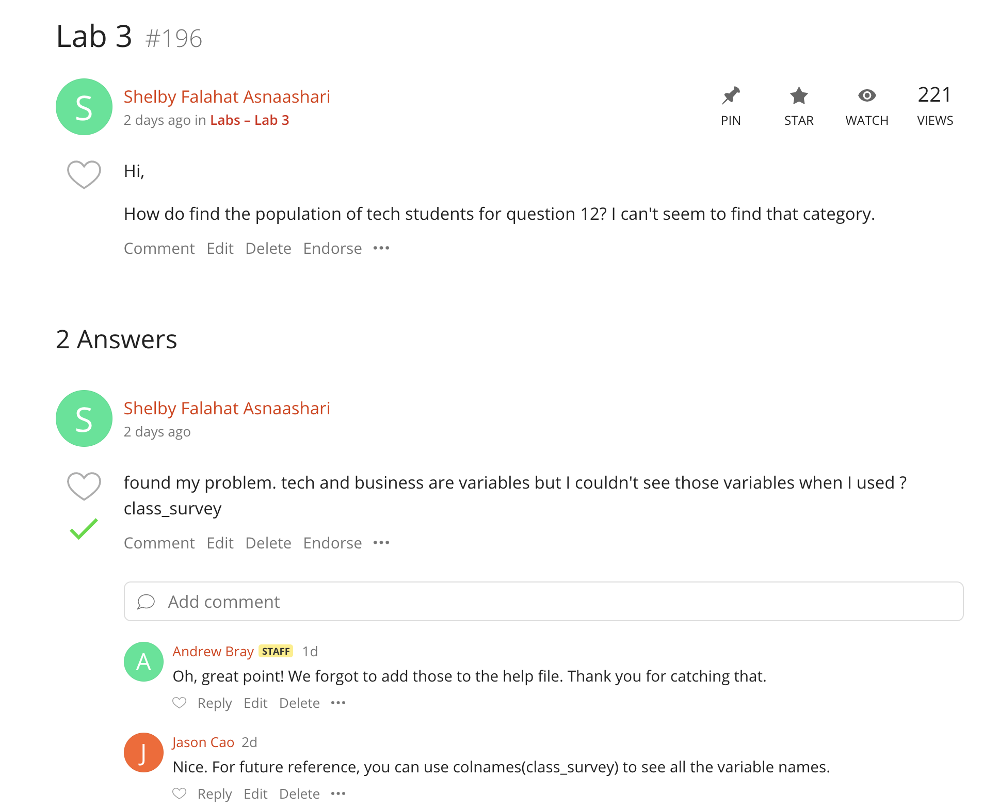
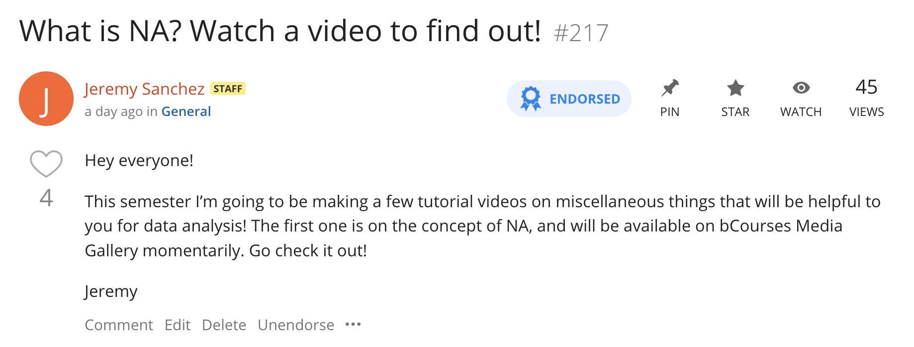
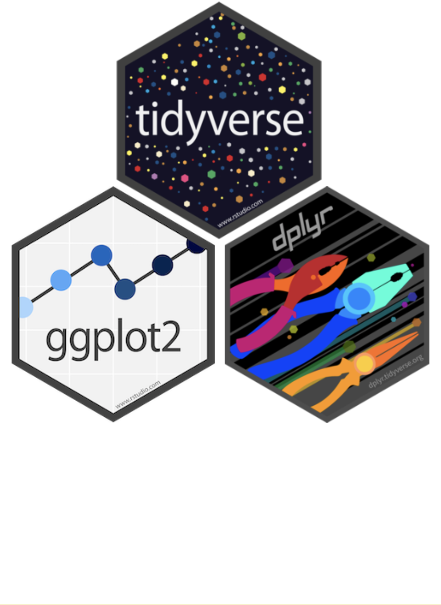
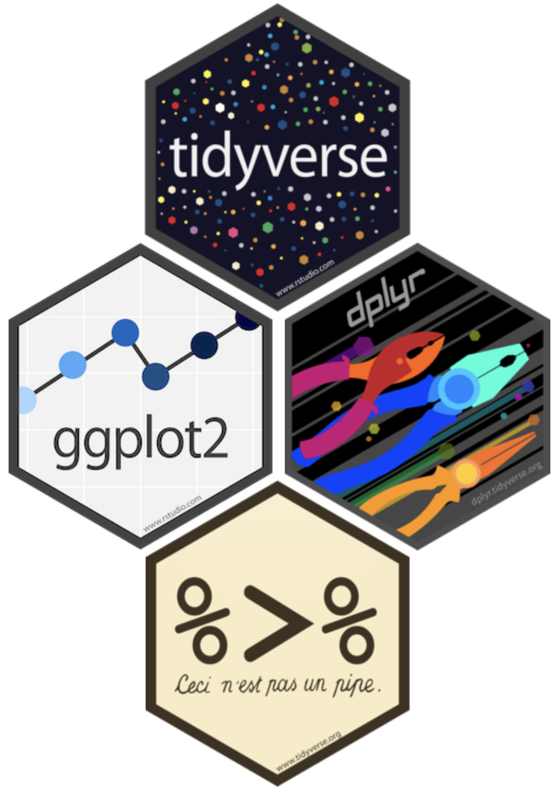

```{r setup, include=FALSE, warning=FALSE}
knitr::opts_chunk$set(message = FALSE,
                      warning = FALSE,
                      echo = FALSE,
                      fig.align = "center",
                      fig.retina = 3)

library(tidyverse)
library(xaringanthemer)
source("https://raw.githubusercontent.com/stat20/course-materials/master/assets/stat20-style.r")
```

class: center, middle

```{r}
#| echo: FALSE
#| out.width: "20%"
knitr::include_graphics("assets/images/stat20-hex.png")
```

# Data Pipelines
## Stat 20 UC Berkeley


---
## Announcements
--

1. Asking and answering questions on Ed.


---

```{r echo = FALSE, out.width="70%"}

```

---
class: middle

<center>
<iframe src="https://giphy.com/embed/fdLR6LGwAiVNhGQNvf" width="480" height="270" frameBorder="0" class="giphy-embed" allowFullScreen></iframe></center>


---
## Good Practices for Ed

.pull-left[
**Asking**

- Search forum before posting
- Use public posts
- Attach posts to existing threads
- Provide the full context of your issue
- Posting code snippets `r emo::ji("thumbs_up")`
- Posting full answers `r emo::ji("thumbs_down")`
- Be kind, be respectful, be professional
]

.pull-right[
**Answering**

- No need to wait for staff!
- Reply with suggestion, answer, or sympathy
- Posting code snippets `r emo::ji("thumbs_up")`
- Posting full answers `r emo::ji("thumbs_down")`
- Be kind, be respectful, be professional
]

---
## Announcements

1. Asking and answering questions on Ed.

--

2. Tutorials


---

```{r echo = FALSE, out.width="100%"}

```


---

```{r echo = FALSE, out.width="100%"}

```


---
## Announcements

1. Asking and answering questions on Ed.

2. Tutorials

--

3. Quiz 1 Again
  - 11 am Thursday - 11 am Friday

--

4. My Office Hours
  - 3-4 pm Evans 415
  

---
## Agenda
--

1. Filtering review

--

2. Building data pipelines

--

3. Aggregating subsets


---
class: middle

# Filtering Review


---

> As London emerged from a COVID lockdown in summer 2020, city officials were eager to encourage ridership on the Underground (the subway) by reassuring the public that it would not be crowded or unsafe. They advertized that, "each train car has a average of only 120 riders".

> Imagine you are a commuter in London and decide to try returning to using the train for your commute. You find that every time you ride, your train car is packed with far more than 120 riders.

> How can you explain this apparent paradox?

.task[
Discuss with your neighbor and try to come up with at least two possible explanations.
]

```{r}
countdown::countdown(1, 30, font_size = "2em")
```


---

---
## Filtering Review
--

**Filtering** is the act of reducing the rows of a data frame to those that meet certain criteria.

--

```{r}
library(tidyverse)
library(stat20data)
data(class_survey)
```

```{r echo = TRUE}
class_survey <- mutate(class_survey, 
                      first_year = time_at_cal == "It is my first year.")
first_year_df <- filter(class_survey, first_year)
```

is equivalent to

```{r echo = TRUE}
first_year_df <- filter(class_survey, time_at_cal == "It is my first year.")
```


---
## Comparison Operators
--

There are many comparisons that can be made for (usually) categorical data (`==`, `!=`, `%in%`) and for numerical data (`<`, `<=`, `>`, `>=`).

```{r echo = FALSE}
knitr::include_graphics("assets/images/comparison-operators.png")
```


---
Which observations will be included in the following data frame?

```{r echo = TRUE, eval = FALSE}
filter(class_survey, 
       coding_exp_scale < 3,
       olympics %in% c("Ice skating", "Speed skating"),
       business != "No")
```

.task[
Please respond at `pollev.com/stat20`.
]


---
class: middle

<center>
<iframe src="https://embed.polleverywhere.com/multiple_choice_polls/28lvboIzDDmDYiWoxjff1?controls=none&short_poll=true" width="800px" height="600px"></iframe></center>

---

```{r eval = TRUE, echo = TRUE}
filter(class_survey, 
       coding_exp_scale < 3,
       olympics %in% c("Ice skating", "Speed skating"),
       business != "No")
```


---

```{r eval = TRUE, echo = TRUE}
select(filter(class_survey, 
              coding_exp_scale < 3,
              olympics %in% c("Ice skating", "Speed skating"),
              business != "No"), 
       coding_exp_scale,
       olympics,
       business,
       covid_fall)
```


---

```{r eval = TRUE, echo = TRUE}
summarize(select(filter(class_survey, 
                        coding_exp_scale < 3,
                        olympics %in% c("Ice skating", "Speed skating"),
                        business != "No"), 
                 coding_exp_scale,
                 olympics,
                 business,
                 covid_fall),
          covid_avg = mean(covid_fall))
```


---
class: middle

# Building data pipelines


---

---
## Data Pipelines
--

Most claims about data start with a *raw* data set, undergo many subsetting, aggregating, and cleaning operations, then return a *data product*.

```{r echo = FALSE, out.width = "75%"}
knitr::include_graphics("assets/images/pipeline-1.png")
```

--

> Let's look at three equivalent ways to build a pipeline


---
## Nesting
--

```{r eval = FALSE, echo = TRUE}
summarize(select(filter(class_survey, 
                        coding_exp_scale < 3,
                        olympics %in% c("Ice skating", "Speed skating"),
                        business != "No"), 
                 coding_exp_scale,
                 olympics,
                 business,
                 covid_fall),
          covid_avg = mean(covid_fall))
```

--

.pull-left[
**Cons**
- Must be read from inside out `r emo::ji("thumbs_down")` 
- Hard to keep track of arguments `r emo::ji("thumbs_down")` 
]

--

.pull-right[
**Pros**
- All in one line of code `r emo::ji("thumbs_up")`
- Only refer to one data frame `r emo::ji("thumbs_up")`
]

---
## Step-by-step
--

```{r eval = FALSE, echo = TRUE}
df1 <- filter(class_survey, 
              coding_exp_scale < 3,
              olympics %in% c("Ice skating", "Speed skating"),
              business != "No")
df2 <- select(df1, coding_exp_scale,
              olympics,
              business,
              covid_fall)
summarize(df2,
          covid_avg = mean(covid_fall))
```

--

.pull-left[
**Cons**
- Have to repeat data frame names `r emo::ji("thumbs_down")` 
- Creates unnecessary objects `r emo::ji("thumbs_down")` 
]

--

.pull-right[
**Pros**
- Stores intermediate objects `r emo::ji("thumbs_up")`
- Can be read top to bottom `r emo::ji("thumbs_up")`
]


---
## Using the pipe operator

Inside the tidyverse is the **pipe operator**, `%>%`, which takes the output of the preceding expression and inserts it as the first argument in the subsequent function.

```{css, echo = FALSE}
.huge .remark-code { /*Change made here*/
  font-size: 150% !important;
}
```

.center[.huge[
```
f1(<DF>) %>% f2()
```
]]

> Add a line break after the pipe to increase readability.

--

```{r echo = TRUE}
filter(class_survey, coding_exp_scale < 3) %>%
  summarize(mean(covid_fall))
```


---
class: middle, center

demo


---

```{r echo = FALSE, out.width = "100%"}
knitr::include_graphics("assets/images/pipeline-2.png")
```


---
## Using the pipe operator
--

```{r eval = FALSE, echo = TRUE}
class_survey %>%
  filter(coding_exp_scale < 3,
         olympics %in% c("Ice skating", "Speed skating"),
         business != "No") %>%
  select(coding_exp_scale,
         olympics,
         business,
         covid_fall) %>%
  summarize(covid_avg = mean(covid_fall))
```

--

.pull-left[
**Cons**
- `r emo::ji("shrug")` 
]

--

.pull-right[
**Pros**
- Can be read like an english paragraph `r emo::ji("thumbs_up")`
- Only type the data once `r emo::ji("thumbs_up")`
- No leftovers objects `r emo::ji("thumbs_up")`
]


---
## Understanding your pipeline
--

It's good practice to understand the output of each line of code by *breaking the pipe*.

--

.pull-left[
**Example**  
What's the error here?

```{r echo = TRUE, eval = TRUE, error=TRUE}
class_survey %>%
  select(covid_fall) %>%
  filter(time_at_cal == "It's my first year.")
```
]

--

.pull-right[
Break the pipe after `select()`

```{r echo = TRUE, eval = TRUE}
class_survey %>%
  select(covid_fall)
```
]


---

```{r echo = TRUE, eval = FALSE}
class_survey %>% # A #<<
  filter(coding_exp_scale < 3,
         olympics %in% c("Ice skating", 
                         "Speed skating"),
         business != "No") %>% # B #<<
  select(coding_exp_scale,
         olympics,
         business,
         covid_fall) %>% # C #<<
  summarize(covid_avg = mean(covid_fall)) # D #<<
```

.task[
What are the dimensions (rows x columns) of the data frames output at each stage of this pipe?
]

```{r}
countdown::countdown(1, 30, font_size = "2em")
```


---
class: middle

<center>
<iframe src="https://embed.polleverywhere.com/multiple_choice_polls/Gf9G67sH10mc7BvtSe4ql?controls=none&short_poll=true" width="800px" height="600px"></iframe>
</center>


---
## Aside
--

.pull-left[
The `tidyverse` package loads other useful packages.

- `ggplot2` for graphics
- `dplyr` for subsetting and aggregation
]

--

.pull-right[
```{r echo = FALSE, out.width = "70%"}

```
]


---
## Aside

.pull-left[
The `tidyverse` package loads other useful packages.

- `ggplot2` for graphics
- `dplyr` for subsetting and aggregation
- `magrittr` for the pipe operator
]

.pull-right[
```{r echo = FALSE, out.width = "70%"}

```
]

---
## Aside

.pull-left[
The `tidyverse` package loads other useful packages.

- `ggplot2` for graphics
- `dplyr` for subsetting and aggregation
- `magrittr` for the pipe operator
]

.pull-right[
```{r echo = FALSE, out.width = "70%"}

```
]


---

```{r echo = FALSE, out.width = "80%"}
knitr::include_graphics("assets/images/magritte.jpeg")
```

---
class: middle

# Group-wise Aggregation

---
## Operating on Subgroups
--

To analyze first-year and non-first-year students separately, we could `filter()` based on a logical vector, then create an analysis pipeline for each one separately.

--

.pull-left[
```{r echo = TRUE, eval = TRUE}
first_year_df <- class_survey %>%
  filter(time_at_cal == "I'm in my first year.")
first_year_df %>%
  summarize(mean(coding_exp_scale,
                 na.rm = T))
```
]

--

.pull-right[
```{r echo = TRUE}
non_first_year_df <- class_survey %>%
  filter(time_at_cal != "I'm in my first year.")
non_first_year_df %>%
  summarize(mean(coding_exp_scale,
                 na.rm = T))
```
]

--

> Can we combine this into one pipeline?


---
## Grouped operations
--

You can flag a data frame as containing subsets using `group_by()`.

.center[.huge[
```
group_by(<GROUPING_VAR1>)
```
]]

--

- Subsequent mutations and summaries will be done on each group separately then recombined.
- Allows multiple grouping variables 


---
## Groupwise Operations
--

```{r gr, echo = TRUE, eval = FALSE}
class_survey %>%
  group_by(time_at_cal) %>% #<<
  summarize(avg_coding = mean(coding_exp_scale,
                              na.rm = T))
```

--

```{r ref.label = "gr", echo = FALSE, eval = TRUE}
```

--

> `group_by() + summarize()` results in a data frame with one group in every row and one statistic in every column.


---

```{r echo = TRUE, eval = FALSE}
library(palmerpenguins)
data(penguins)
penguins %>%
  group_by(species) %>%
  drop_na(bill_length_mm) %>%
  summarize(avg_length = mean(bill_length_mm))
```

.task[
What will the dimensions of the resulting data frame be?
]

---
class: middle

<center>
<iframe src="https://embed.polleverywhere.com/multiple_choice_polls/9K93vfYYjTF0NingoINyD?controls=none&short_poll=true" width="800px" height="600px"></iframe>
</center>


---

```{r echo = TRUE, eval = TRUE}
library(palmerpenguins)
data(penguins)
penguins %>%
  group_by(species) %>%
  drop_na(bill_length_mm) %>%
  summarize( avg_length = mean(bill_length_mm))
```


---
## Multiple grouping variables
--

> What are the dimensions of the resulting data frame?

```{r mg, echo = TRUE, eval = FALSE}
penguins %>%
  group_by(species, island) %>% #<<
  drop_na(bill_length_mm) %>%
  summarize( avg_length = mean(bill_length_mm))
```

--

```{r ref.label = "mg", echo = FALSE, eval = TRUE}
```


---
## Looking forward
--

.pull-left[
- Practice, practice, practice

  - Labs Thurs, next Tues
  - Evening Study Session Thurs, Mon
  - Office Hours

- Lab 4 / PS 4 due **Wednesday 10 pm**

]

--

.pull-right[
<iframe src="https://i.makeagif.com/media/10-06-2016/btmRJ5.gif" width="480" height="270" frameBorder="0" class="giphy-embed" allowFullScreen></iframe></center>
]
